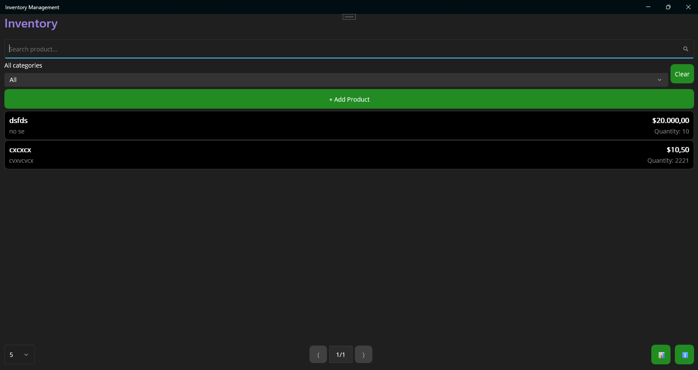
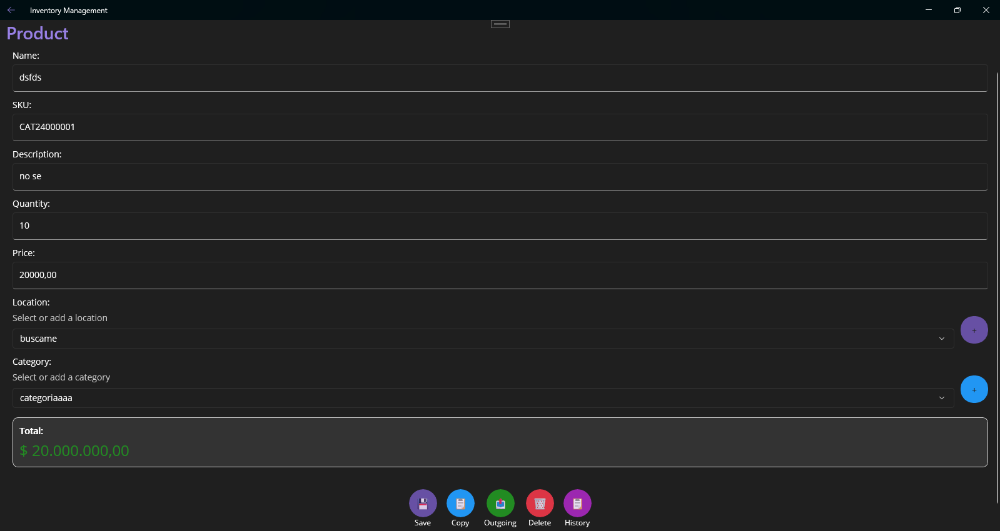
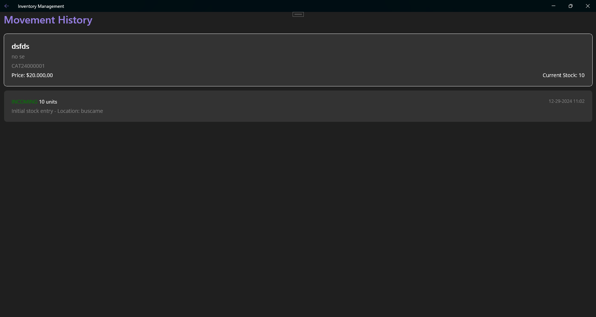
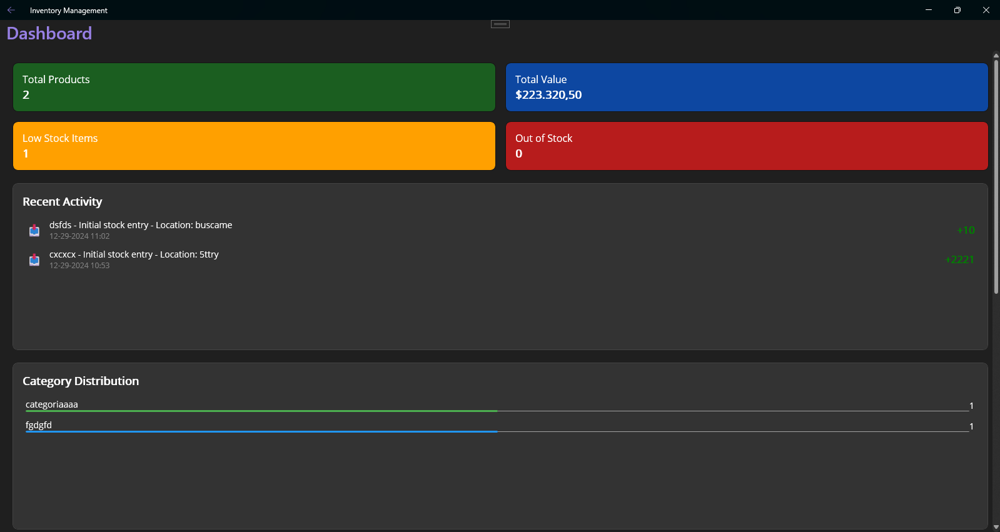

<h2 align="center">Simple Inventory Management MAUI</h2>

Effortlessly manage your inventory, track incoming and outgoing products, view detailed statistics, and keep a history of all transactions. Backup your data, restore backups, and easily export your inventory to Excel for further analysis.

<h2 align="center">Instructions for Windows</h2>

- Extract the contents somewhere, in Documents or C:/ is a good idea. Never extract the folder to C:/Program Files (x86) or any other system folder.
- Install Microsoft Windows Desktop Runtime 8.0.12 (x64) (if it is not installed on your system, running the application exe will take you to the website for download and installation).
- Inside the folder, find the executable InventoryManagementMAUI.exe to use the application.

<h2 align="center">Captures</h2>

<h2 align="center">Download</h2>

